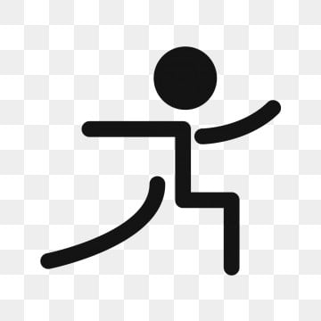

# Posture Guard - AI-Powered Posture Detection



Real-time AI-powered posture detection system that helps you maintain proper sitting posture using your webcam. Get instant feedback to prevent back pain and improve your sitting habits.

## ✨ Features

- 🖥️ Real-time posture detection using your webcam
- 📊 Posture analysis and feedback
- ⏱️ Session tracking and statistics
- 🔔 Posture alerts and reminders
- 🌙 Dark/Light mode support
- 🚀 Built with React, TypeScript, and TensorFlow.js

## 🚀 Getting Started

### Prerequisites

- Node.js 18+ and npm
- Webcam access
- Modern web browser with WebRTC support

### Installation

1. Clone the repository:
   ```sh
   git clone https://github.com/Barsaan/posture-pal.git
   cd posture-pal
   ```

2. Install dependencies:
   ```sh
   npm install
   ```

3. Start the development server:
   ```sh
   npm run dev
   ```

4. Open [http://localhost:5173](http://localhost:5173) in your browser

## 🛠️ Built With

- [React](https://reactjs.org/) - Frontend library
- [TypeScript](https://www.typescriptlang.org/) - Type checking
- [Vite](https://vitejs.dev/) - Build tool
- [TensorFlow.js](https://www.tensorflow.org/js) - Machine learning
- [shadcn/ui](https://ui.shadcn.com/) - UI components
- [Tailwind CSS](https://tailwindcss.com/) - Styling

## 🤝 Contributing

Contributions are welcome! Feel free to open an issue or submit a pull request.

1. Fork the project
2. Create your feature branch (`git checkout -b feature/AmazingFeature`)
3. Commit your changes (`git commit -m 'Add some AmazingFeature'`)
4. Push to the branch (`git push origin feature/AmazingFeature`)
5. Open a Pull Request

## 📄 License

This project is licensed under the MIT License - see the [LICENSE](LICENSE) file for details.

## 🙏 Acknowledgments

- [MediaPipe Pose](https://google.github.io/mediapipe/solutions/pose) for the pose detection model
- [shadcn/ui](https://ui.shadcn.com/) for the beautiful UI components
- Edit files directly within the Codespace and commit and push your changes once you're done.

## What technologies are used for this project?

This project is built with:

- Vite
- TypeScript
- React
- shadcn-ui
- Tailwind CSS

## How can I deploy this project?

Simply open [Lovable](https://lovable.dev/projects/REPLACE_WITH_PROJECT_ID) and click on Share -> Publish.

## Can I connect a custom domain to my Lovable project?

Yes, you can!

To connect a domain, navigate to Project > Settings > Domains and click Connect Domain.

Read more here: [Setting up a custom domain](https://docs.lovable.dev/features/custom-domain#custom-domain)
